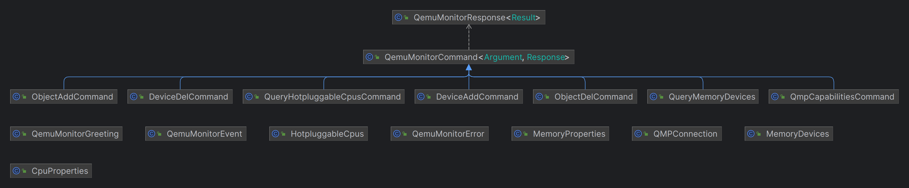

# qemu-monitor-java-client



## Build & Run
- maven clean -> maven install
- Run the command below in Linux machine installed QEMU
```shell
java -jar qemu-monitor-java-client-1.0-SNAPSHOT.jar
```
## Adding the library to your project
Maven dependency:
```xml
<dependency>
    <groupId>org.thouy.qemu.monitor.client</groupId>
    <artifactId>qemu-monitor-java-client</artifactId>
    <version>1.0-SNAPSHOT</version>
    <scope>system</scope>
    <systemPath>${project.basedir}/libs/qemu-monitor-java-client-1.0-SNAPSHOT.jar</systemPath>
</dependency>
```
Gradle dependency:
```gradle
dependencies {
    compile files('libs/qemu-monitor-java-client-1.0-SNAPSHOT.jar')
}
```

## Quick start
```java
QMPConnection connection = new QMPConnection("unixSocketFilePath");
// Build DeviceAdd command arugment
DeviceAddCommand.Arguments arguments = DeviceAddCommand.Arguments.builder()
                .id(cpuId)
                .driver("host-x86_64-cpu")
                .socketId(1)
                .coreId(0)
                .threadId(0)
                .build();

// Execute command & get command result
DeviceAddCommand.Response result = connection.invoke(new DeviceAddCommand(argumemts));
connection.close();
```
